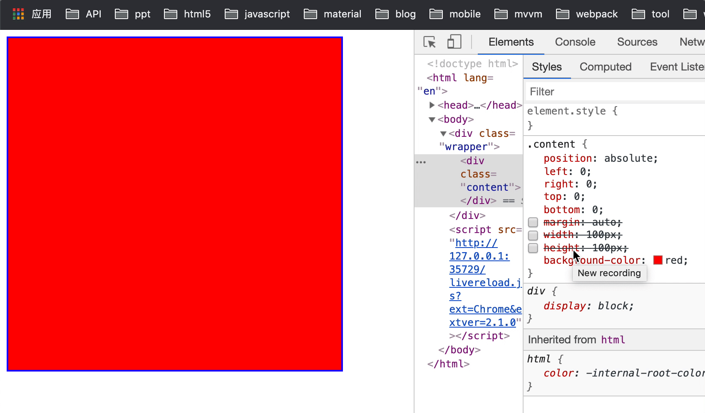
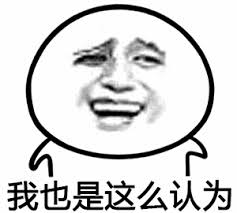

# CSS垂直居中、水平居中

让一个div或者一段文字亦或者一张照片居中显示的问题，面试的过程中也经常被问到。相信大家都日常的布局也经常会用到，回答出个三两种解决方案亦不是难事。但今天我细究了一下，发现还有新大陆可寻，特意留此博文总结一下，与君分享！如果你有新的方法，欢迎补充！👏👏👏

## 我们先从固定宽高的div开始

为方便演示，默认宽高各为100px的div

	

	  

	

***以下方式全部是水平及垂直居中***

#### 方法一：padding填充
	.content{
		margin: 0 auto;
		padding: 50px;
		width: 100px;
		height: 100px;
		background-color: red;
	}
优点：兼容性非常好
缺点：如果父级的高度受到兄弟节点的影响，这样自己就不居中了

#### 方法二：绝对定位

	.wrapper{
		position: relative;
	}
	
	.content{
      position: absolute;
      left: 50%;
      top: 50%;
      margin-top: -50px;
      margin-left: -50px;
      width: 100px;
      height: 100px;
      background-color: red;
    }
 
优点：兼容性非常好
缺点：需要提前知道div的宽高，实用性偏弱

#### 方法三：计算属性（calc）
	
	margin: calc((100% - 100px) / 2);
	width: 100px;
	height: 100px;
	background-color: red;
	
优点：感觉不到有什么优点
缺点：不仅需要提前知道div的宽高，而且浏览器对calc的属性支持程度不一，会有兼容问题。不推荐使用，建议作为了解

## 接下来是不固定宽高的div

为方便演示，还是默认宽高各为100px的div

#### 方法四：absolute + margin: auto;

	.wrapper{
		position: relative;
	}
	.content{
      position: absolute;
      left: 0;
      right: 0;
      top: 0;
      bottom: 0;
      margin: auto;
      width: 100px;
      height: 100px;
      background-color: red;
    }
    
优点：不需要提前知道尺寸，兼容性好
缺点：暂时没有什么要说的，可能理解起来比较麻烦吧

解析：

1、我们先让content脱离文档流，然后设置上右下左四个位置均为0

2、给它固定宽高，限制大小

3、利用margin属性，均分外边距

#### 方法四：absolute + transform

	.content{
      position: absolute;
      left: 50%;
      top: 50%;
      width: 100px;
      height: 100px;
      transform: translate(-50%,-50%);
      background-color: red;
    }
  
优点：除了不用提前知道大小好像也没什么了
缺点：兼容性偏弱

#### 方法五：父级flex布局
	.wrapper{
		display: flex;
		justify-content: center;
		align-items: center;
	}
优点：写法极度简单明了
缺点：就是兼容性偏差，未来它可能是解决居中的王道（个人观点）

#### 方法六：父级table布局
	
	.wrapper{
		display: table-cell;
		vertical-align: middle;
	}
	
	.content{
		margin: 0 auto;
	}
	
优点：写法极度简单明了,兼容性极好
缺点：就是有点老了

还有一个更古老（有毒）的想法：

	<table style="table-layout:fixed; width: 400px;">
		<tr>
      		<td height="400" align="center" valign="middle">
      			

      		</td>
    	</tr>
    </table>
    
说！你们是不是想说:

说实话，都9012年，谁要是在我的项目里这么干

#### 方法七：伪元素

	.wrapper{
      width: 400px;
      height: 400px;
      text-align: center;
      border: 2px solid blue;
    }
    .wrapper:after{
      content: '';
      display: inline-block;
      height: 100%;
      vertical-align: middle;
    }

    .content{
      display: inline-block;
      vertical-align: middle;
      width: 100px;
      height: 100px;
      background-color: red;
    }
    
 #### 方法八：伪元素的另外一种实现方式（兄弟节点）

html:

	

    	

    	

	

	
	
style:
	
	.wrapper{
      width: 400px;
      height: 400px;
      text-align: center;
      border: 2px solid blue;
    }
  
    .content, .brother {
      display: inline-block;
      vertical-align: middle;
    }
    .content {
        width: 100px;
        height: 100px;
        background-color: red;
    }
    .brother {
        height: 400px;
    }
	
说实话，我也不知道这是为什么，《CSS世界》第四章在讲解这个，如果有需要PDF换私信我哦！我要跑步去了，恐怕没有时间了，下次知道原因再给家解析吧，或者评论告诉我。

再补充点吧！

#### 方法九： line-heght（仅限单行文字垂直居中)
	
	.wrapper {
	   height: 400px;
	   line-height: 400px;
	   border: 1px solid red;
	}
#### img居中

如同这样的效果：

其实上面的方法一道八变通一下，都可以实现图片的居中，这里再分享一个奇技淫巧！
	
	.wrapper{
      width: 400px;
      height: 400px;
      text-align: center;
      border: 2px solid blue;
      background-image: url('./bg.jpg');
      background-repeat: no-repeat;
      background-position: center;
    }
    
就是background-position：center

好了

<contact></contact>
