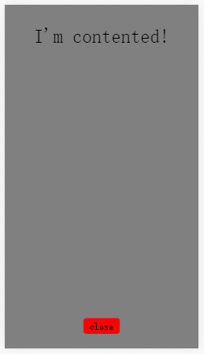

# 固定底部（sticky footer）一道经典的css面试题。

在日常的web APP开发当中，我们会遇到这样的一个这样的布局

​


布局要求：
一、内容比较少的时候，关闭按钮要始终在屏幕的下方

二、当「优惠信息和商家公告」变多，关闭按钮会自动被撑下去

如下图gif:



当我第一次碰到这样要求的布局时，说实话，我有点蒙圈。
别着急往下翻，咱们先来思考一下，如何实现？fix？height：100%？
看到要求一的时候，我觉得很简单吗！用fix属性可以轻松实现。看到要求二的时候，我发现我太年轻了，这个根本不可能实现啊？或者说fix属性肯定是不能实现的了。


后来还是找到了一个不错的解决办法：
```html

<div class="content-wrapper">
  <div class="content">
    <p>I'm contented!</p>
    <!-- put your html in here -->
  </div>
</div>
<div class="footer">
  <span>close</span>
</div>
```

html部分准备完毕！


接下来就是css 部分了
首先是全屏显示那么高度100%就避免不了：

```css
html,body{
  margin: 0;
  padding: 0;
  height: 100%;
}
```
接下来我们把内容区域填充满，使用 min-height属性。
并给一个半透明的背景效果:

```css
.content-wrapper{
  overflow: auto;
  min-height: 100%;
  background-color: rgba(0,0,0,.5);
}
.content-wrapper .content{
  padding-bottom: 64px;
  text-align: center;
}
.footer{
  margin-top: -46px;
  height: 46px;
  width: 100%;
  text-align: center;
}
.footer span{
  padding: 5px 10px;
  background-color: red;
  border-radius: 5px;
}
```

然后对内容区域（content）进行一个“留白”处理。使用padding-bottom：64px为footer 腾出空间，以免content的内容会被 footer 给覆盖。


最后，给footer一个margin-top负值操作，就可以实现了。


写在后面：
这样的布局还是有点一点瑕疵的！比如：

1、footer div的高度必须固定。

2、content div的padding-bottom值必须根据footer div的高度值修改而修改。


最后放上几个参考网站！

<a href="https://css-tricks.com/couple-takes-sticky-footer/">https://css-tricks.com/couple-takes-sticky-footer/</a>   


<contact></contact>
