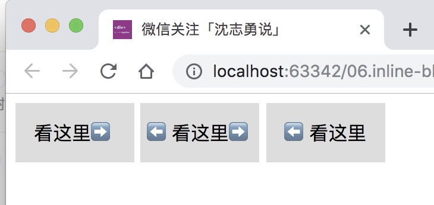

# 如何解决inline-block的间隔问题

## 需求
在我们日常开发当中，我们经常会遇到将一些元素排列成一行的需求。这样的需求实现起来却是不难，我们可以利用浮动，利用flex布局都可以实现，但是今天我们要用inline-block的方法。

```html
<div class="box">看这里➡️</div>
<div class="box">⬅️看这里➡️</div>
<div class="box">⬅️看这里</div>
```

```css
.box{
    display: inline-block;
    width: 100px;
    height: 50px;
    background-color: #ddd;
    text-align: center;
    line-height: 50px;
}
```

## 现象
我们就得到了这样的效果：



我们不难发现，我们并没有使用margin值。但是它们之间确有间隔。很显然，这不是我们想要的结果，那是为什么导致这样呢？如何解决它呢？

### 原因

其实，html的原因。我们回顾一下这段代码：

```html
<div class="box">看这里➡️</div>
<div class="box">⬅️看这里➡️</div>
<div class="box">⬅️看这里</div>
```
我们不仅看到元素节点，属性节点还有文本节点，问题就是处在文本节点的渲染导致3px(chrome)的间隔。那如何解决它？

## 解决办法

### 方法一、删除空白节点
同样的方法，有五种写法

```
<div class="box">看这里➡️</div><div class="box">⬅️看这里➡️</div><div class="box">⬅️看这里</div>

```


```
<div class="box">看这里➡️</div
><div class="box">⬅️看这里➡️</div
><div class="box">⬅️看这里</div>
```
或者

```
<div class="box">看这里➡️</div
><div class="box">⬅️看这里➡️</div
><div class="box">⬅️看这里</div>
```
亦或者

```
<div class="box">
看这里➡️</div><div class="box">⬅️看这里➡️
</div><div class="box">⬅️看这里</div>
```
或者添加 注释标签

```
<div class="box">看这里➡️</div><!--
--><div class="box">⬅️看这里➡️</div><!--
--><div class="box">⬅️看这里</div>
```

以上的这些方法，无一列外破坏了代码的可读性。

### 方法二、标签自动补全

我这里插一句。我有个有毒的面试题，拿出来跟大家分享一下。请问a标签嵌套a标签。

```
    <a href="https://shenzhiyong.com.cn/">扫码关注！<a href="https://github.com/szy1000">沈志勇说</a></a>

```
请问点击「扫码关注」和「沈志勇说」分别跳转到哪里？

其实在浏览器会自己帮你解析错误帮你解析成正确的代码

```
<a href="https://shenzhiyong.com.cn/">扫码关注！</a>
<a href="https://github.com/szy1000">沈志勇说</a>
```

其实，上面的这个面试题就是我自己在项目中犯的错！

我们回到主题：既然a标签能自己校正，那我们故意偷懒呢？

```
<a class="box">看这里➡️
<a class="box">⬅️看这里➡️
<a class="box">⬅️看这里
```

很显然是可以的，但是div是不行的。我亲自测试过！不过你在项目不要这样写，免的被喷死！

### 方法三、负的marigin值

```css
.box {
    margin: -3px; /*左右缩小3px*/
    display: inline-block;
    width: 100px;
    height: 50px;
    background-color: #ddd;
    text-align: center;
    line-height: 50px;
}
```
这样的方式，可以解决chrome下面的问题。但是不建议使用。因为在某些游览器上面，这个文本节点可能设置成4px的间隔。因为解决问题，引入了新的问题，那就尴尬！

### 方法四、 font-size: 0

既然是文本节点导致的，那我们就把文本节点设置成0不就ok?顺着这个思路，我们这些写：
我们先给div加一个父级节点

```html
<div class="wrapper">
    <div class="box">看这里➡️</div>
    <div class="box">⬅️看这里➡️</div>
    <div class="box">⬅️看这里</div>
</div>
```

``` css
.wrapper{
	font-size: 0;
}
.box {
    font-size: 14px;
    display: inline-block;
    width: 100px;
    height: 50px;
    background-color: #ddd;
    text-align: center;
    line-height: 50px;
}
```

主要： 因为font-size是默认继承的属性。所以父级给了0，子级要重新设置font-size： 14px。

### 方法五、 补充 letter-spacing和word-spacing
后来我看到这样2个方法，其实这种方法跟margin为负值的相同。还有比较生僻的方法就不一一介绍了。

<contact></contact>