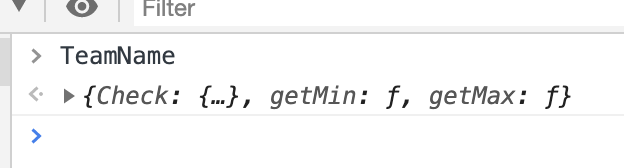

 

 # JS设计模式-单例模式

>保证一个类仅有一个实例，并提供一个访问它的全局访问点。

回忆起自己入行不久的时候，曾遇到过一个这样的任务：验证用户的输入，正确以后，发送给后端进行注册。


```javascript
function checkName(value) {
  // ... 
  getAjax(value) // 防止用户已经注册
}

function checkPassword(value){
  // ...
}

function checkTelphone(value) {
  // ...
}
function getAjax(value) {
  // ...
}

function postAjax(value) {
  // ...
}
```
当我完成任务以后，仔细检查了好几遍，确定没有bug了。就反馈给老大，我完成了。那时候我的心情就如同下图。


可谁知，老大看了一眼说：“不行啊！小沈。你一个表单验证，就定义了这么多的方法，而且还是全局的，很容易跟别人的冲突啊。”

“那怎么解决呢？“ 

## 一、命名空间
老大耐心的说到：可以使用命名空间（namespace）去解决。我们团队四个人，每个人的姓名都不一样。我们可以用每个人的姓名，去定义一个相同名字的对象，然后把各自写的方法放在自己的对象下面，如同这样：

```javascript
var shenzhiyong = {
    checkName: function(value) {},
    checkPassword: function() {},
    getAjax: function() {},
    postAjax: function() {},
}
```
然后调用的时候,这样就可以了。

```javascript
shenzhiyong.checkName(value)
```
需要注意的是，你对象内部调用ajax的时候，需要这样改写一下：

```javascript

var shenzhiyong = {
    checkName: function(value) {
      // ...
      this.getAjax(value) // 防止用户已经注册
    },
    checkPassword: function() {},
    getAjax: function() {},
    postAjax: function() {},
}
```
我不禁感叹：确实很牛！完成任务和合理完成任务，还是有一段距离的。

老大继续说到：其实，大公司里面，都会有自己模块文件。进行代码管理，比如这样：

```javascript	
var TeamName = {
  Check: {
    name: function() {},
    telphone: function() {}
  },
  Ajax: function() {
    get: function() {},
    post: function() {}
  },
  // ...
}
```
这样做的好处，你能总结一下吗？
我自信答道：

* 模块分明，代码可维护性高。
* 节约命名空间。
* 避免全局污染。

嗯！这就是单例模式，又称单体模式。


## 二、私有变量&&静态变量
老大继续问到：如果 TeamName 上面有2个默认值，只允许访问，不允许修改。你有什么好的解决办法吗？

```javascript
var TeamName = {
  var _minVaule = 0,
  var _maxValue = 1000,
  Check: {
    name: function() {},
    telphone: function() {}
  },
  // ...
}
```
java里面有static关键字，js里面没有。那就需要用到闭包和立即执行函数了，我啪啪敲出下面：（啪啪是敲击键盘的声音）

```javascript
var TeamName = (function() {
  var _minValue = 0;
  var _maxValue = 1000;
  return {
    Check: {
      name: function() {},
      telphone: function() {}
    },
    getMin: function() {
      return _minValue
    },
    getMax: function() {
      return _maxValue
    }
  }
})()
```
老大满意的说：你在控制台输入 TeamName 试试？

返回的是一个对象。单例不仅仅可以，可以做到管理命名空间，而且还可以模拟实现静态变量。

## 三、惰性单例
老大继续说到：我们都知道，这样做会使得对象很大。有些时候需要延迟调用。但上面你已经用了IIFE，可以解决吗？

思绪片刻后，这个可不会啊？求教！求教！


其实可以这样：

```javascript
var LazySingle = (function() {
  var _instance = null
  function Singleton() {
    return {
      Check: {
        name: function() {},
        telphone: function() {}
      },
      getMin: function() {
        return _minValue
      },
      getMax: function() {
        return _maxValue
      }
    }
  }
  return function() {
    if(!_instance) {
      _instance = Singleton()
    }
    return _instance
  }
})()
```
这样的话，我们就可以通过执行LazySingle获取内部创建的单例对象了。

好了说到这里，我发现老大的脸上，露出了跟我一样的期待：


但我就是不夸你是大神 哈哈！
<contact></contact>
