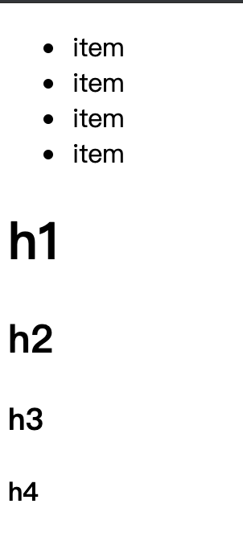

# 什么是语义化标签？有哪些优点？

> 前言：说到这个问题，让我想到了刚入行时候的自己。菜鸟一枚（现在依旧很菜）。在看JD（job description）的时候。总是遇到一些新名词。上面的这个就是。听上去，感觉好高大上的啊！要想拿到offer，那就查呗！

要说语义化标签，我们要从HTML4说起。在HTML5出现之前的时代里，前端开发的主要机制就是div。通篇下来基本是div。如果想实现内容区域的划分，基本靠的是给标签属性添加不同的值进行标识。如：<code>class=‘header’</code> , <code>id=‘header’</code>。基本页面代码如下：

```html
<!DOCTYPE html PUBLIC "-//W3C//DTD XHTML 1.0 Strict//EN"
 "http://www.w3.org/TR/xhtml1/DTD/xhtml1-strict.dtd"> 
<html> 
 <head> 
   <title> HTML4 Page </title> 
 </head> 
 <body> 
   <div id='header'>Header</div> 
   <div id='content'>Content</div> 
   <div id='footer'>Footer</div> 
 </body> 
</html>
```
目前文档结构十分简单，我们可以根据标签的id属性，很容易的分辨出哪里是头部，哪里是主体部分。想象一下，如果内容变多了该如何是好？而且id的值是具有任意性的，比如：id = "content"和id = "main" 都可以代表主要内容区域。我们还可以清楚的发现标签（div）除了显示一个节点之外，其本身并没有起到内容区域区别的作用。
## 一、结构化明显
后来HTML5的规范化发布，带来了需要新标签比如 header section footer等等。了解更多H5标签[戳我](https://developer.mozilla.org/zh-CN/docs/Web/Guide/HTML/HTML5/HTML5_element_list)
接下来我们改写一下：

```html
<!DOCTYPE html> 
<html> 
 <head> 
   <title> HTML5 Page </title> 
 </head> 
 <body> 
 	<header>Header</header>
	<section>Content</section>
	<footer>Footer</footer>
 </body> 
</html>
```
**不难发现，标签语义化之后，它给我们带来的第一个优点：页面节点更明确了，也更具结构化。**

## 二、基础样式
我们都知道，很多标签都是有默认样式的。比如：ul li h1-h6,效果如下：



**这样的表现形式，让我们感受到第二个优势：当页面css，因为某些情况加载失败的时候，我们还能看到基础的样式。**

## 三、 SEO
计算机不会像我们人类一样去读懂网页内容。爬虫机器人是爬虫网页标签内显示的内容。比如你的网站里面有这样的代码

```html
<h1>沈志勇</h1>
<h2>web</h2>
<div>javascript</div>
```
机器人会认为：这个网站是一个跟沈志勇重度相关的网站，跟web相关性要差点。根JavaScript的相关性就更差了。
当用户在搜索沈志勇的时候，会将我们网站排名靠前。搜索web的话，我们排名靠后一点。

**第三个优势：合理使用语义话标签，有益于我们网站的排名。**

## 总结一下：

标签语义化的意思： 就是包裹的内容要和标签的语义相一致。

优点：

* 页面结构明确，便于维护。
* 缺失css，亦能阅读，便于理解
* 方便搜索引擎解析


<contact></contact>
