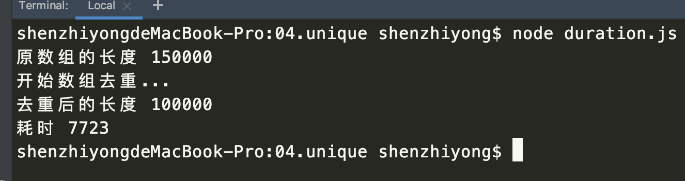
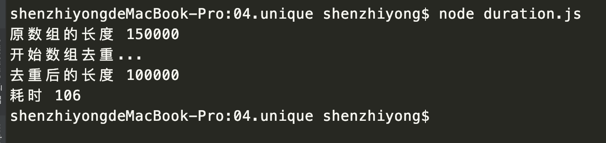
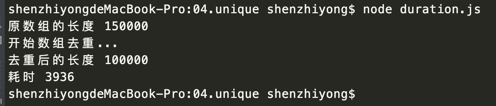
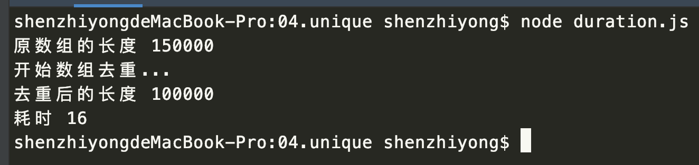
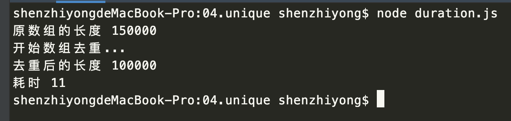

# Javascript数组去重方法汇总

## 前言

关于数组去重，也算是一个比较常见的面试题了。但是有点开发经验的同学又会发现，前端数组去重的操作很少见（也可能是我个人经验不足遇到的比较少）。这是为什么呢？。我感觉可能是大部分的去重操作被后端处理了。个人见解！
虽然，前端很少用到。本着爱（kuai)与(su)和(zhang)平(xin)的精神，我们也来学习一波！

## 方法汇总

### 一、IndexOf
IndexOf是数组的一个原生方法，当你传入一个参数的时候，它会返回入参数的索引值。如果未找到就返回 -1。利用这一特性，

```javascript
function unique(array) {
	var res = []
	for(var i = 0; i < array.length; i++) {
		if(res.indexOf(array[i]) === -1) {
			res.push(array[i])
		}
	}
   return res
}
```
相信一般求职者都能回答出这个，当初我在面试的时候，也回答了这一项。也只是回答出了这一项。后来面试官继续问：还有其他方式吗？这种方式的效率高吗？复杂度是多少？


后来这场面试就失败了，没关系！痛定思痛继续学习。
后来我知道了，indexOf需要把每个参数重新判断一遍。效率很低下。而且indexOf还不能查到<code>NaN</code>的索引值，如下代码:

```javascript
var arr = [1, NaN]
arr.indexOf(NaN)   // -1
```
那如何解决这个查询问题呢？我们下次谈include和indexOf的时候细说!

我们先来验证一下indexOf的效率问题？后面想想怎么提高？

我们先准备两个数组，一个长度为：100000 一个：50000

```javascript
var arr1 = Array.from(new Array(100000), (x, index)=>{
  return index
})

var arr2 = Array.from(new Array(50000), (x, index)=>{
  return index+index
})

var handleArray = arr1.concat(arr2)
console.log('原数组的长度',handleArray.length)
let start = new Date().getTime()
console.log('开始数组去重...')
function unique(array) {
  var res = []
  for(var i = 0; i < array.length; i++) {
    if(res.indexOf(array[i]) === -1) {
      res.push(array[i])
    }
  }
  return res
}
console.log('去重后的长度', unique(handleArray).length)

let end = new Date().getTime()
console.log('耗时', end - start)
```
执行结果如下：


一个150000的数组，去重要7723毫秒。（该值存在波动，这是一个平均值，后续相同）

### 二、排序后去重（sort()）
我们可以先对数组进行排序，将相似的值排到一起

```javascript
function unique(array) {
  var sortArr = array.concat().sort() //返回新数组
  var res = [sortArr[0]]
  for(var i=1; i < sortArr.length; i++) {
  	if(sortArr[i] !== sortArr[i-1]) {
  		res.push(sortArr[i])
  	}
  }
  return res
}
```

**代码解析：** 

* 1、我们先对数组进行排序，为了不影响原数组，我们使用了concat()方法，返回新数组。
* 2、将排序好的数组进行相邻位的比较。如果不相等，推到结果数组里。相等跳过操作。
* 3、res = [sortArr[0]] 和 i = 1 是个初始化操作

>这样的做法，省去了对重复参数的索引。效率上面确实也提升不少。对于一些重复性比较高的数组进行去重，效率明显提升。

我们看一下优化后的效果：



看到这个结果，吓我一跳啊！竟然只要106毫秒。优化真的是一门学问啊！

### 三、利用双层循环
上面的两种方法都是使用了indexOf这个api,除了这个有没有其他的呢？答案是肯定的。就是利用双层循环

```javascript
function unique(array){
	var res = []
	for(var i=0;i<array.length;i++) {
	  	for(var j=0;j<res.length;j++) {
	  		if(array[i] === res[j]) {
	  			break
	  		}
	  	}
	  	if(j === res.length) {
	  		res.push(array[i])
	  	}
	}
	return res	
}
```

**代码解析：** 

* 1、对初始值数组进行每一项与目标数组每一项进行比较
* 2、如果有重复就跳出循环
* 3、如果全部都不相等，那么j就会等于res.length。此时，把值添加到res中

这样的方法，不失为一种新解法。但是由于双层循环的存在，其效率也不会改善多少。



我们看到相比方法一确实快了不少，但是效率还是比较低下的。不推荐大家使用！

### 四、利用ES6 new Set()
这个是es6的语法糖，极度简单明了！效率也是杠杠滴！

```javascript
function unique(array){
	return Array.from(new Set(array) 
	// return [...new Set(array)]
}
```
这样的方法，没啥好说的。就是一个字快！

我们看看执行效果：

官方的优化总是不让人失望，真的太牛了！爸爸始终是爸爸！


### 五、利用对象属性不可重复（该方法有局限性，不推荐使用）
```javascript
function unique(array){
  var obj = {}
  var res = []
  for(var i =0; i < array.length; i++) {
  	if(!obj[array[i]]) {
  		res.push(array[i])
  		obj[array[i]] = 1
  	} else {
  		obj[array[i]]++
  	}
  }
  return res
}
```
**代码解析：** 

* 1、申明一个对象，将数组里每一项的值作为对象的key
* 2、判断obj.key值是否为undefined？是！则目标数组将key作为一个参数项添加进来。并给obj.key 一个默认值 1
* 3、obj.key不是undefined的话，则证明目标数组已经有key的参数项。对obj.key进行加1操作即可。

再来看一下：



看到这个图的时候！我不禁多执行了几次。但是事实告诉我：你没有看错，比new Set()还要高效。

> 重点说明一下：就是对象 1 和 ‘1’ 这样的方式无法区分。需要引入typeof hasOwnProperty等操作。这里就不展开讨论了。


## 总结
在写去重之前，我也看了网上不少博文。说多少种的都有。其实感觉就是使用了不同的语法糖进行了循环操作和删除操作。比如 filter reduce for of include splice
Map等方法。思路和想法确实很新颖。我把链接放到了下面。还有我自己的测试代码，如需自取。


正在读此文的朋友，如果明天面试官问你这样的问题，你是不是跟我一样的心态呢？


源码地址：

[源码](https://github.com/szy1000/vuepress/blob/master/docs/js/04.unique/duration.js)

参考链接：

[ JavaScript数组去重（12种方法，史上最全）](https://segmentfault.com/a/1190000016418021#articleHeader9)

[JavaScript 高性能数组去重](https://www.cnblogs.com/wisewrong/p/9642264.html)

<contact></contact>


