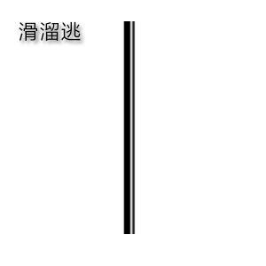

# JS 对象的深拷贝和浅拷贝

### 现象
我们先来看一个demo

```javascript
// 我们先申明一个变量str1，
// 然后把变量str1负值（拷贝）给变量str2 
// 最后对变量str2进行修改操作
var str1 = 'shen'
var str2 = str1
str2 += 'zhiyong'
console.log('str1:', str1)       //shen
console.log('str2:', str2)		   //shenzhiyong
```
我们申明一个对象并对它进行相同的操作

``` javascript
var obj1 = {
name: 'shen'
}
var obj2 = obj1
obj2.name = 'shenzhiyong'

//期望输出
// obj1: {name: "shen"}
// obj2: {name: "shenzhiyong"}

console.log('obj1:', obj1)   // obj1: {name: "shenzhiyong"}
console.log('obj2:', obj2)   // obj2: {name: "shenzhiyong"}
```

我们不难发现结果并不是我们预期的那样， 这是为什么呢？如果将obj1改成数组对象进行操作，亦是同样的结果。
	
***原因***：由于String类型属于基本数据类型，Object(Array)属于引用数据类型。当我们申明一个基本类型并对它进行赋值的时候，计算机会将值保存在栈内存中。而当我们申明一个引用数据类型并对它进行赋值的时候，计算机会将值保存在堆内存中，引用类型变量其实就是一个指针指向堆内存中。如果复制两相同的引用类型变量，其实它们最终指向同一个对象或者说堆内存空间。

关于JavaScript的数据类型 我们先埋下一个坑！

## 一、浅拷贝

对象和数组的浅拷贝代码如下：

```javascript
var obj1 = {
name: 'shen'
}
var obj2 = obj1
obj2.name = 'shenzhiyong'

console.log('obj1:', obj1)   // obj1: {name: "shenzhiyong"}
console.log('obj2:', obj2)   // obj2: {name: "shenzhiyong"}

var arr1 = [1,2,3]
var arr2 = arr1
arr2.push(4)
console.log('arr1:', arr1)   // arr1: [1,2,3,4]
console.log('arr2:', arr2)   // arr2: [1,2,3,4]

```

浅拷贝的意思就是只复制引用，没有复制真正的值。有时候我们只是想保留对象的数据，单纯想改变obj2和arr2的值，但是原对象的数据也发生了改变。很多时候这种情况都不是我们想要的。为了解决这个问题： 深拷贝它来了！

## 二、深拷贝

### JSON方法

```javascript
var obj1 = {
	name: 'shen'
}
var obj2 = JSON.parse(JSON.stringify(obj1))
obj2.name = 'shenzhiyong'
	
console.log('obj1:', obj1)   // obj1: {name: "shenzhiyong"}
console.log('obj2:', obj2)   // obj2: {name: "shenzhiyong"}
```

优点：简单明了，方便记忆

缺点：看下面代码。当对象里面出现函数的时候就不适用了。

```javascript
var obj1 = {
	name: 'shen',
	show: function (argument) {
		console.log(1)
	}
}
var obj2 = JSON.parse(JSON.stringify(obj1))
console.log('obj1:', obj1)  // obj1: {name: "shen", show: ƒ}
console.log('obj2:', obj2)	// obj2: {name: "shen"}
```

### 手写递归方法

```javascript

function deepCopy(obj) {
  var newobj = obj.constructor === Array ? [] : {};
  if (typeof obj !== 'object') {
    return obj;
  } else {
  for (var i in obj) {
    if (typeof obj[i] === 'object'){ //判断对象的这条属性是否为对象
      newobj[i] = deepCopy(obj[i]);  //若是对象进行嵌套调用
    }else{
      	newobj[i] = obj[i];
    	}
  	}
	}
	return newobj; //返回深度克隆后的对象
}

var obj1 = {
	name: 'shen',
	show: function (argument) {
		console.log(1)
	}
}
var obj2 = deepCopy(obj1)
console.log('obj1:', obj1)  // obj1: {name: "shen", show: ƒ}
console.log('obj2:', obj2)	// obj2: {name: "shen"}

```

优点：能够实现对象和数组的深拷贝

缺点：如果拷贝的对象嵌套过深的话，会对性能有一定的消耗

### 第三方库 jQuery.extend 和 lodash

	$.extend( true, object1, object2 ); // 深度拷贝
	$.extend( object1, object2 );  // 浅拷贝
	
	
	var objects = [{ 'a': 1 }, { 'b': 2 }];
	var deep = _.cloneDeep(objects);
	console.log(deep[0] === objects[0]); // => false
	
大佬写的东西，我只能说：逃



## 三、重点来了：具有局限性的深拷贝(有些面试官就喜欢问这个地方的东西)

当对象或者数组内部的都是基本数据类型的话，以下的方式可以实现深拷贝。但是如果出现了引用类型嵌套引用类型的话。以下方法将不可用。


看下面代码：
	
	var obj = {
		name: 'shen'
	}
	
	var obj2 = {
		innner: {
			name: 'shen'
		}
	}
	
以下方法仅支持obj此类对象的深度拷贝不支持obj2此类对象

### es6解析结构 「...」
	
```javascript
var obj1 = {
	name: 'shen',
	show: function (argument) {
		console.log(1)
	}
}
var obj2 = { ...obj1 }
obj2.name = 'shenzhiyong'
console.log('obj1:', obj1)  // obj {name: "szy", show: ƒ}
console.log('obj2:', obj2)	 // obj2 {name: "shenzhiyong", show: ƒ}
```

### Object.assign()

```javascript
var obj1 = {
	name: 'shen',
	show: function (argument) {
		console.log(1)
	}
}
var obj2 = Object.assign(obj1)
obj2.name = 'shenzhiyong'
console.log('obj1:', obj1)  // obj {name: "szy", show: ƒ}
console.log('obj2:', obj2)	 // obj2 {name: "shenzhiyong", show: ƒ}
```

### 数组中的slice() & concat()

```javascript
var arr1 = [1,2,3]
var arr2 = arr1.slice()  // 方法一
// var arr2 = arr1.concat()  //方法二
arr2.push(4)
console.log('arr1:', arr1)  // arr1: [1, 2, 3]
console.log('arr2:', arr2)  // arr1: [1, 2, 3, 4]

```
	

总结：要想实现真正意义的深拷贝，个人觉得还是递归的方法比较靠谱。其实看第三方的库也是采用这样的做法。在实际的生产当中，我使用的是lodash。

放水完毕！

<contact></contact>

